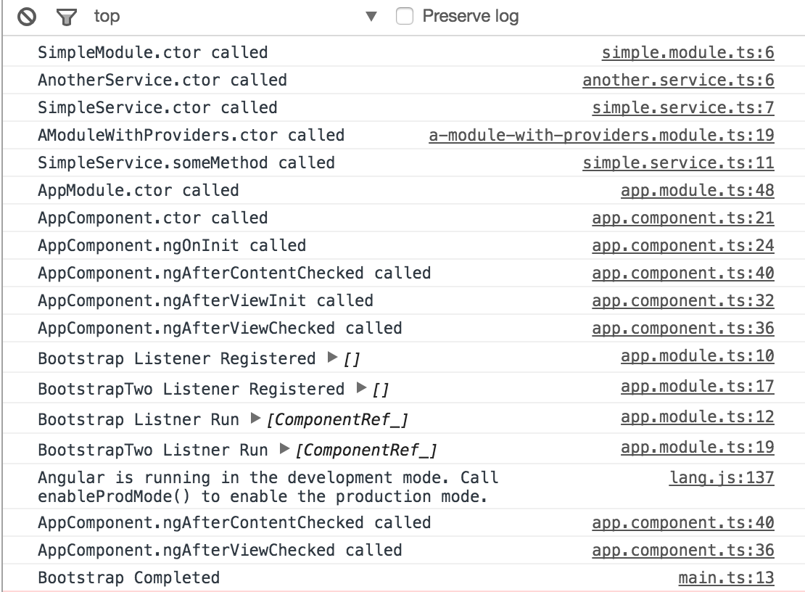

# NgxWhatLoadsWhen

This project was generated with [angular-cli](https://github.com/angular/angular-cli) version 1.0.0-beta.26.

Simply meant to demonstrate when instances of services, modules, components are created, and in relation to component lifecycle hooks.

Nothing fancy going on - just a few console.logs

Main point to note: You can inject into a constructor of an Angular Module, and have access to DI within it. 

## Development server
Run `ng serve` for a dev server. Navigate to `http://localhost:4200/`. The app will automatically reload if you change any of the source files.

